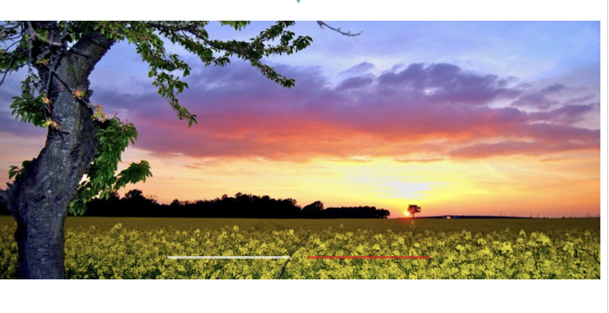
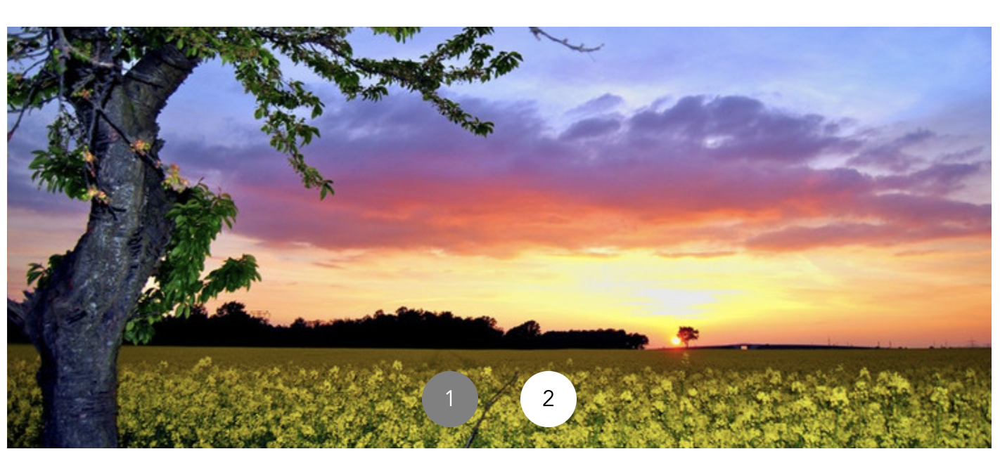

# vue-easy-swiper

PC端轮播图

功能：

- 循环滚动
- 

## 安装

```
npm install -S vue-easy-swiper
```

## 使用

```
<template>
  <div id="app">
    
    <swiper :images="images" class="swiper" />
  </div>
</template>

<script>
import Swiper from 'vue-easy-swiper'

export default {
  name: 'App',
  components: {
    Swiper,
  },
  data() {
    return {
      images: [
        'https://gimg2.baidu.com/image_search/src=http%3A%2F%2Fwww.soumeitu.com%2Fwp-content%2Fuploads%2F2020%2F07%2F5efd4bc254c10.jpg&refer=http%3A%2F%2Fwww.soumeitu.com&app=2002&size=f9999,10000&q=a80&n=0&g=0n&fmt=jpeg?sec=1629630925&t=608a56a47a9b890725fbf158dadfd4a6',
        'https://gimg2.baidu.com/image_search/src=http%3A%2F%2Fimg3.ph.126.net%2Fp-RJ33HgAuhSQOMCsyQ0UA%3D%3D%2F3099883918532000103.jpg&refer=http%3A%2F%2Fimg3.ph.126.net&app=2002&size=f9999,10000&q=a80&n=0&g=0n&fmt=jpeg?sec=1629630925&t=39052dbea1dac7b90660e830c27c9e80',
      ],
    }
  },
}
</script>

<style>
#app {
  font-family: Avenir, Helvetica, Arial, sans-serif;
  -webkit-font-smoothing: antialiased;
  -moz-osx-font-smoothing: grayscale;
  text-align: center;
  color: #2c3e50;
  margin-top: 60px;
}
.swiper {
  width: 100px;
  height: 300px;
}
</style>
```



### 自定义指示器

```
<template>
  <div id="app">
    
    <swiper :images="images" class="swiper" @change="change">
      <div slot="indicator">
        <div
          v-for="(i, index) in images.length"
          :key="index"
          class="indicator-item"
          :class="{ 'indicator-item-active': curIndex == i }"
        >
          {{ i }}
        </div>
      </div>
    </swiper>
  </div>
</template>

<script>
import Swiper from '../package/src/swiper'

export default {
  name: 'App',
  components: {
    Swiper,
  },
  data() {
    return {
      curIndex: 1,
      images: [
        'https://gimg2.baidu.com/image_search/src=http%3A%2F%2Fwww.soumeitu.com%2Fwp-content%2Fuploads%2F2020%2F07%2F5efd4bc254c10.jpg&refer=http%3A%2F%2Fwww.soumeitu.com&app=2002&size=f9999,10000&q=a80&n=0&g=0n&fmt=jpeg?sec=1629630925&t=608a56a47a9b890725fbf158dadfd4a6',
        'https://gimg2.baidu.com/image_search/src=http%3A%2F%2Fimg3.ph.126.net%2Fp-RJ33HgAuhSQOMCsyQ0UA%3D%3D%2F3099883918532000103.jpg&refer=http%3A%2F%2Fimg3.ph.126.net&app=2002&size=f9999,10000&q=a80&n=0&g=0n&fmt=jpeg?sec=1629630925&t=39052dbea1dac7b90660e830c27c9e80',
      ],
    }
  },
  methods: {
    change(index) {
      this.curIndex = index
      console.log(index)
    },
  },
}
</script>

<style>
#app {
  font-family: Avenir, Helvetica, Arial, sans-serif;
  -webkit-font-smoothing: antialiased;
  -moz-osx-font-smoothing: grayscale;
  text-align: center;
  color: #2c3e50;
  margin-top: 60px;
}
.swiper {
  width: 100px;
  height: 300px;
}
.indicator-item {
  color: white;
  float: left;
  width: 40px;
  height: 40px;
  background: gray;
  display: flex;
  justify-content: center;
  align-items: center;
  border-radius: 20px;
  margin: 15px;
}
.indicator-item-active {
  background: white;
  color: black;
}
</style>

```



## Attributes

| 参数         | 说明                                                         | 类型    | 可选值     | 默认值 |
| ------------ | ------------------------------------------------------------ | ------- | ---------- | ------ |
| images       | 要预览的图片地址<br>除了字符串数组还支持对象数组，但对象中要有一个src属性是图片地址，<br>例如：images = [{id: 1, src: "http://xxxx/xxx.jpg"}] | array   | --         | [ ]    |
| interval     | 轮播图间隔时间                                               | number  | --         | 3000   |
| animDuration | 轮播图动画时间                                               | number  | --         | 1000   |
| stopAnim     | 鼠标悬停上去的时候停止动画                                   | boolean | true/false | false  |

## slot

| 参数      | 说明         |
| --------- | ------------ |
| indicator | 自定义指示器 |

## Event

| 参数   | 说明                                                 | 回调参数 |
| ------ | ---------------------------------------------------- | -------- |
| click  | 轮播图被点击，如果`images`中是对象，则回调参数为对象 | item     |
| change | 图片切换时的回调                                     | index    |

